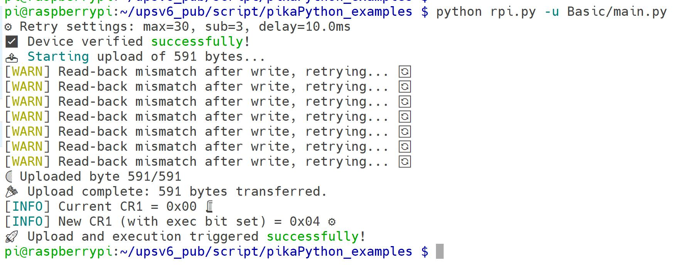
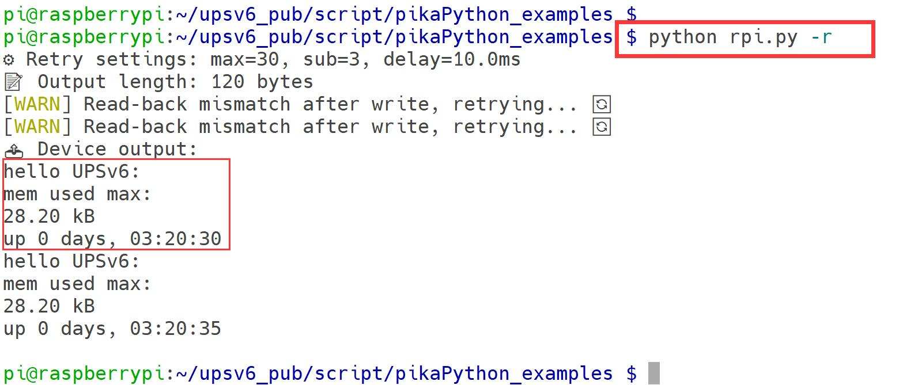
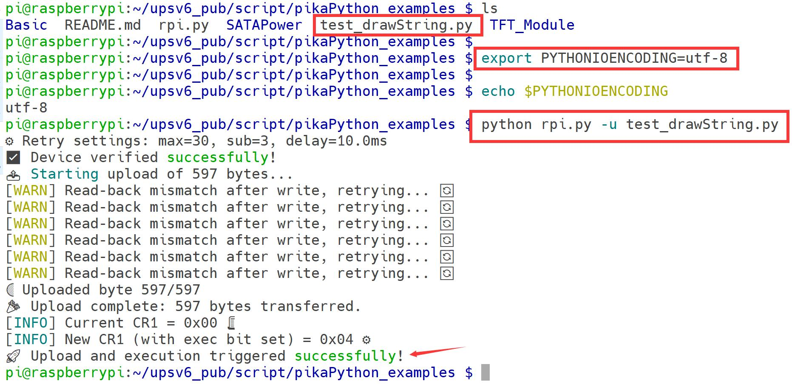

# How to upload pikaPython script to UPS? 

## Description 
There are PikaPython code files with different extension modules in the current directory, and they are updated irregularly. Among them, rpi.py is a tool for uploading PikaPython code to the PikaPython interpreter on the UPSv6 MCU. You can get help information by running `python rpi.py -h`.

## Demo 

### Navigate to repository  
```bash
pi@raspberrypi:~/upsv6_pub/script/pikaPython_examples $ pwd
/home/pi/upsv6_pub/script/pikaPython_examples
pi@raspberrypi:~/upsv6_pub/script/pikaPython_examples $ ls
Basic  README.md  rpi.py  SATAPower  TFT_Module
```

### Getting Help

> NOTE: Before you use `rpi.py`, please make sure your environment support `UTF-8`, if not, please execute following command first:

```bash
export PYTHONIOENCODING=utf-8
```

> Next:
```python
pi@raspberrypi:~/upsv6_pub/script/pikaPython_examples $ python rpi.py -h
usage: rpi.py [-h] [-u FILE] [-r] [--max-retry MAX_RETRY] [--retry-delay RETRY_DELAY]

🧪 Communication tool for I2C devices

options:
  -h, --help            show this help message and exit
  -u FILE, --upload FILE
                        📤 Upload and execute specified binary file
  -r, --read            📥 Read output from device
  --max-retry MAX_RETRY
                        Max retry attempts (default: 30)
  --retry-delay RETRY_DELAY
                        Retry delay in ms (min 1, default 10)
```

### Upload pikaPython Script

Open a terminal window on your Raspberry Pi, then navigate to the directory of this repository within the window, and then execute:

```
python rpi.py -u <path_to_pikapython_script>
```

Replace `<path_to_pikapython_script>` with the actual path to your PikaPython script.


### Read output 

```python
python rpi.py -r 
```

### Demostration 
* UPS Basic Demo:
```bash
python rpi.py -u Basic/main.py 
```




* TFT Module Demo:
Upload a test code when you finished editing, which name is `test_drawString.py`

```bash 
python rpi.py -u test_drawString.py 
```



